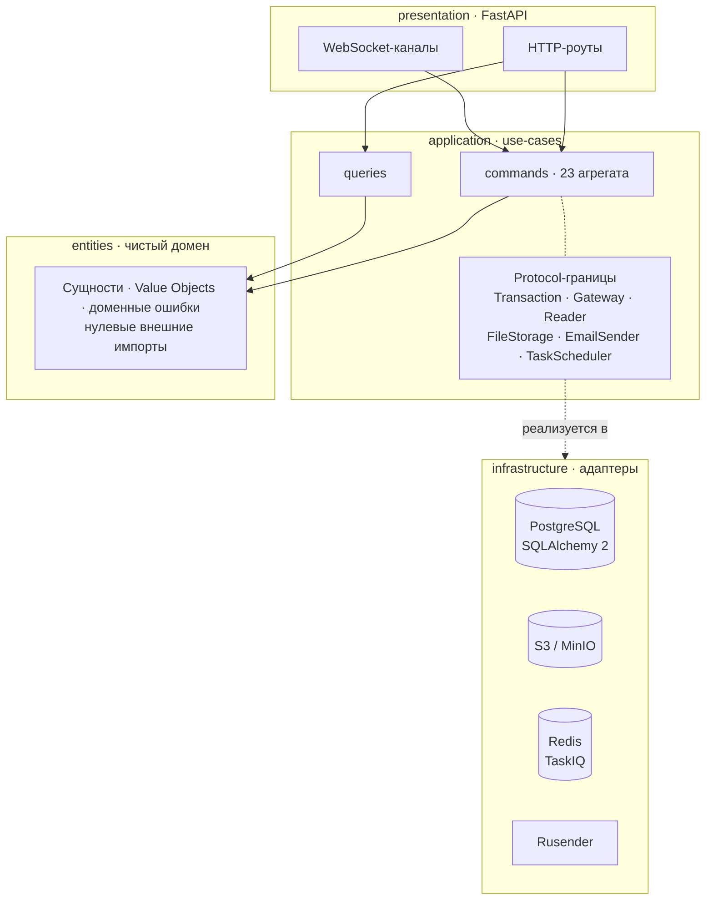

<div align="center">

# 📚 Learnic

**Конспекты собираются из блоков, публикуются версиями и редактируются вдвоём — в реальном времени.**

Бэкенд платформы: Clean Architecture, CQRS и 23 агрегата на FastAPI.


[Фронтенд](https://github.com/iuriishikov/learnic-web) · [Архитектура](#-архитектура) · [Быстрый старт](#-быстрый-старт) · [Команды](#-команды)

</div>

---

## 🎯 Что это

Сайт конспектов для студентов и репетиторов. Автор собирает конспект из блоков — текст, код, формулы, интерактивные чертежи — публикует его версиями и открывает доступ другим.

| | Возможность |
|---|---|
| ✍️ | **Конспект из блоков.** Черновик, модули, уроки, релизы: контент версионируется, читатель видит опубликованную версию, автор правит следующую |
| 👥 | **Соавторство в реальном времени.** Присутствие, курсоры соавторов и синхронизация черновика идут по WebSocket |
| 💬 | **Вопросы к автору.** Обсуждение привязано к конспекту, а не к комментариям под ним |
| 🎁 | **Подарки и оплата.** Конспект можно купить или подарить; квоты и биллинг живут отдельным агрегатом |
| 🔔 | **Уведомления.** In-app, e-mail и web-push с раздельными настройками по типам событий |
| 🛡️ | **Роли и модерация.** Админка, роли, модерация публикаций и чистка брошенных черновиков |

---

## 🏗 Архитектура

Зависимости текут только внутрь. Домен не знает ни про FastAPI, ни про SQLAlchemy, ни про S3.



**Три правила, на которых всё держится**

| | Правило |
|---|---|
| 🧱 | `entities/` не импортирует ничего внешнего — ни ORM, ни фреймворк |
| 🔌 | `application/` объявляет границы через `Protocol`, `infrastructure/` их реализует: хранилище или брокер задач меняются, не задевая бизнес-логику |
| 🗺️ | Маппинг SQLAlchemy **императивный** — доменные сущности ничего не знают о таблицах |

---

## ⚙️ Стек

| Слой | Технология |
|---|---|
| Язык | Python 3.14 |
| HTTP | FastAPI + uvicorn (gunicorn в проде) |
| БД | PostgreSQL 16, SQLAlchemy 2 (async `asyncpg`) |
| Миграции | Alembic |
| Фоновые задачи | TaskIQ + Redis |
| Объектное хранилище | S3-совместимое (`aioboto3`), локально MinIO |
| Реальное время | WebSocket: присутствие, курсоры, уведомления |
| Аутентификация | JWT (`pyjwt`) + Argon2, сессии, verify-email и reset-password |
| Push | Web Push (VAPID) |
| Email | Rusender |
| DI | dishka |
| Валидация | Pydantic 2 |
| TLS на проде | Caddy с автоматическим ACME |
| Тесты | pytest + pytest-asyncio + httpx (ASGI transport) + fakeredis |
| Качество кода | ruff, mypy (strict), bandit, semgrep, codespell |
| Оркестратор | just + docker compose |

---

## 🚀 Быстрый старт

```bash
git clone https://github.com/iuriishikov/learnic && cd learnic
cp .env.dist .env        # отредактировать под себя
just dev-up              # postgres + minio + redis в docker, приложение локально
```

API — `http://localhost:8000`, Swagger — `http://localhost:8000/docs`.

---

## 🧰 Команды

| Рецепт | Что делает |
|---|---|
| `just dev-up` | Поднять dev-инфраструктуру, синхронизировать `.env`, запустить app + worker + scheduler с reload |
| `just dev-down` | Остановить dev-инфраструктуру (volumes сохраняются) |
| `just check` | Гейт качества: ruff + codespell + mypy + bandit + semgrep |
| `just prod-up` | Прод-стек с собственным HTTPS-edge (раздельный деплой фронта и API) |
| `just prod-up-colocated` | Прод-стек, где один Caddy обслуживает и фронтенд, и API |
| `just prod-down` | Остановить прод-стек (volumes сохраняются) |

---

## 📁 Структура

```
src/learnic/
├── entities/          # чистый домен: сущности, VO, ошибки
├── application/
│   ├── commands/      # write-side, 23 агрегата
│   ├── queries/       # read-side
│   └── common/        # Protocol-границы: persistence, storage, email, tasks
├── infrastructure/    # SQLAlchemy-мапперы, S3, Rusender, TaskIQ, миграции
├── presentation/http/ # роуты, WebSocket-каналы, схемы, обработчики ошибок
├── bootstrap.py       # сборка приложения
├── ioc.py             # dishka-провайдеры
├── web.py             # фабрики приложения
└── worker.py          # энтрипоинт TaskIQ-воркера
```

---

## 🔒 Качество и безопасность

| | |
|---|---|
| 🧪 | `mypy` в strict-режиме, `ruff` как линтер и форматтер, `codespell` на опечатки |
| 🕵️ | `bandit` и `semgrep` в том же гейте, что и тесты |
| ⚡ | Тесты бьют по приложению через ASGI-транспорт `httpx`, без поднятия HTTP-сервера |
| 🔑 | Секреты живут в `.env` на сервере (он в `.gitignore`); CI их не видит и не логирует |
| 🗄️ | Медиа отдаются по подписанным ссылкам, публичный доступ к бакету закрыт |

---

## 🚢 Деплой

Прод описан в `docker-compose.yaml`: Postgres → migrate → app → Caddy, плюс TaskIQ worker и scheduler. Сертификат выпускается автоматически через Let's Encrypt при первом запуске.

Выкатка — GitHub Actions (`.github/workflows/deploy.yml`) по push в `main`: раннер подключается к серверу по SSH, подтягивает `main` и пересобирает стек на месте. Миграции применяются внутри стека до старта приложения.

---

## 📄 Лицензия

Пока не определена.
